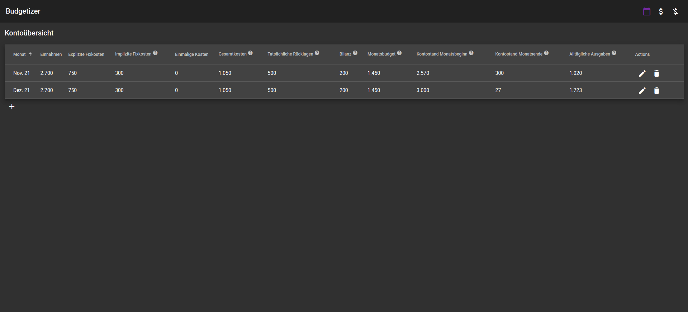
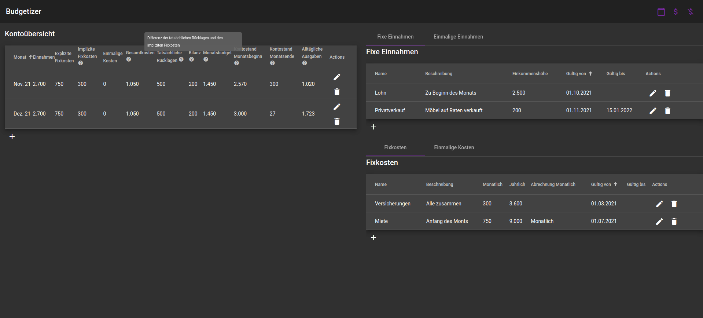

# Budgetizer

The Budgetizer is a interactively frontend driven tool that is intended to help get and keep an overview of your financial conditions.
You can enter data of your incomes, spendings and account overviews. All Entities are bound to dates. You can therefor check the incomes and spendings of a single month. Some insights are calculated on the fly based on the entered data.

Basically this is project to try the used technologies, the **MVVM pattern** and the **flux pattern**.
Further developments are possible but not necessary since the current scope matches my needs.

## Test it

No real installation is provided.
To use it one has to do the following steps:

### Start the express server

* navigate to express-server dir 
	* `cd express-server`
* start the server
	* `node index.js`

Now the provided data will be stored as json in `express-server/data`.

### Start the budgetizer angular implementation

* navigate to budgetizer-angular dir 
	* `cd budgetizer-angular`
* start the development mode
	* `ng serve`

Now you can manage your financial conditions under `localhost:4200`.

## Software Architecture

The Frontend app is where all logic and functionality happens. The `express-server` is only used to persist the data as raw json-arrays. The further documentation is only related to the frontend app. 

The Tool makes extensive use of the flux pattern. The state is managed in a data store which is the single source of truth of the data. The data inside the store is raw json.

Each type inside the store has a representation as a ViewModel which is used for the presentation in the frontend and extended with further functionality.

Each compontent is the owner of its data-type inside the store. All other components can only read the data. For instance can only the `RegularIncomeComponent` write `RegularIncomes` to the data-store wheras the `MonthlyAccountOverviewComponent` can read and use it for furhter calculations.

## Used Software Frameworks and libs

* Views:
	* [angular](https://angular.io/docs)
	* [angular material](https://material.angular.io/)
* state-management
	* [ngrx](https://ngrx.io/)
* Backend
	* [node](https://nodejs.org/)
	* [express](https://expressjs.com/)
	* [express-cors](https://expressjs.com/en/resources/middleware/cors.html)

## Notes considering the Business Logic 

The budgetizer consist basically of 3 views each for *incomes*, *spendings* and the *account overview*. The Views are placed on one screen and designed as tables. The views can be activated by buttons at the toolbar. The frontend is not responsive and designed for default sized screens. There is potential for improvement.
The screendesign uses *material design*.
The Views are updated instantly while when data has been saved.
The tool is not internationalised and only available in the german language.
All calculations are explained via tooltips placed in the heading-row of the tables.
There is no real installtion provided yet. You can test the tool by starting the development environment only.

### Entities

It basically consists of 3 entites.

#### Income

Incomes is the amount of money you get for a month. 
There are 2 types of incomes.

##### Regular Incomes

Incomes that you have every month. They have a start date and an end-date. If the end-date is not set, the income is considered forever.

##### One Time Incomes

One Time Incomes are incomes that happen only once. They have a specific date when you get them.

#### Spending

Incomes is the amount of money you spend for a month. 
There are 2 types of spendings.

##### Regular Spendings

Spendings that you have every month. They have a start date and an end-date. If the end-date is not set, the spending is considered forever.

##### One Time Spendings

One Time Spendings are spendings that happen only once. They have a specific date when you have spend them.

#### Account overview

An Account Overview is a representation of the money on your bank account. The Overview is on a monthly basis. Here you have to consider, that the overview does not necessarily match the month exactly. When for instance your wage comes at the end of the month, you can consider it as the start of the next month.

You can provide some real data to an overview like the amount of money at the start and the end of an month and the amount of money you put aside to save it for instance.

All other data is calculated based on the incomes and spendings belonging to this month and the provided data.
The balance for instance is the difference of all spendings which are not billed monthly and the real leaving (money you put aside). The column 'alltägliche Ausgaben' is calculated by the the amount of money at the start and end of the month subtracted by all the spendings and the real leaving.

